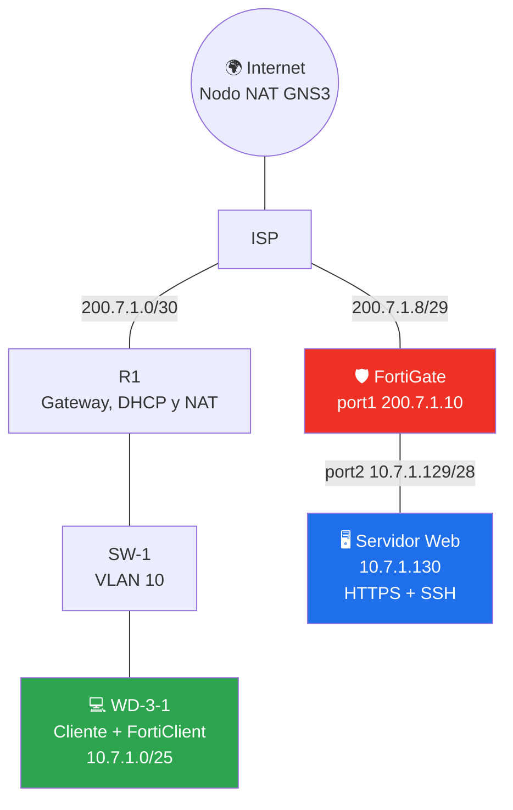
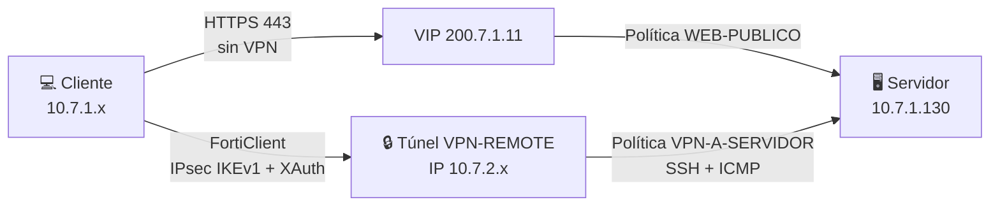
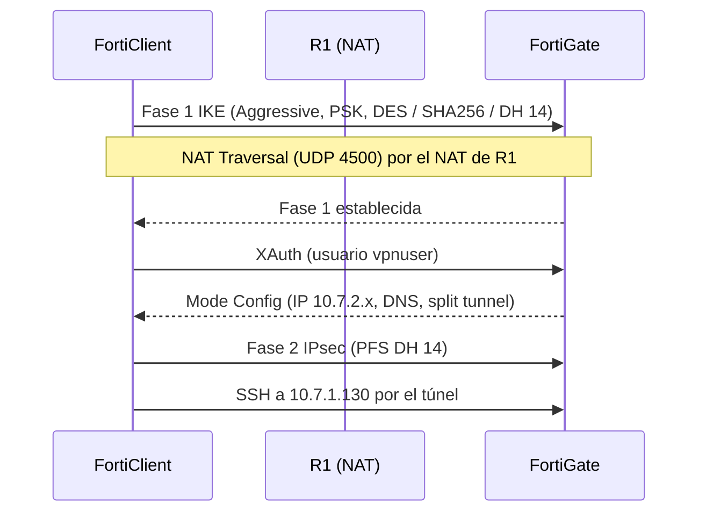

<div align="center">

# 🛡️ VPN CLIENT TO SITE

### Acceso remoto seguro con **FortiGate** · IPsec IKEv1 · FortiClient


**Lisbeth Gómez** · Matrícula **2025-0701** · Seguridad de Redes  
Profesor: **Jonathan Rondón** · Octubre 2026

</div>

---

## 🎬 Video demostrativo

<div align="center">

### [▶️ Ver el video demostrativo](https://youtu.be/yQBdTHzGysI)

</div>

---

## 📑 Contenido

1. [🎯 Propósito del laboratorio](#-propósito-del-laboratorio)
2. [🗺️ Diseño de la topología](#-diseño-de-la-topología)
3. [🧮 Direccionamiento IP](#-direccionamiento-ip)
4. [🔀 Flujo de acceso y establecimiento de la VPN](#-flujo-de-acceso-y-establecimiento-de-la-vpn)
5. [🔧 Configuración de los equipos de red](#-configuración-de-los-equipos-de-red)
6. [🖥️ Servidor web](#-servidor-web)
7. [💻 Cliente](#-cliente)
8. [🛡️ Configuración del FortiGate por GUI](#-configuración-del-fortigate-por-gui)
9. [📲 FortiClient VPN](#-forticlient-vpn)
10. [🧪 Pruebas de funcionamiento](#-pruebas-de-funcionamiento)
11. [📂 Running-configs](#-running-configs)
12. [✅ Cumplimiento de requisitos](#-cumplimiento-de-requisitos)
13. [🏁 Conclusiones](#-conclusiones)
14. [💡 Recomendaciones](#-recomendaciones)

---

## 🎯 Propósito del laboratorio

Implementar y demostrar un **acceso seguro a un servidor mediante un FortiGate**:

| 🌐 Servicio | 🔐 Condición de acceso |
|---|---|
| Servidor web **HTTPS** | Accesible **sin VPN**, publicado con una Virtual IP |
| Servidor **SSH** | Accesible **únicamente a través de la VPN** IPsec |

El laboratorio practica direccionamiento IP, VLAN, DHCP, NAT, publicación de servicios con Virtual IP, VPN de acceso remoto (IPsec IKEv1 con XAuth y Mode Config) y políticas de firewall bajo el principio de **mínimo privilegio**. Toda la configuración del FortiGate se realizó por **GUI**.

## 🗺️ Diseño de la topología

La red se compone de tres bloques conectados a través de un ISP: el **sitio del cliente** (usuarios en VLAN 10), el **sitio del servidor** protegido por el FortiGate y la salida a **Internet** mediante el nodo NAT de GNS3.



#### 📸 Figura 1 — Topología en GNS3


#### 📸 Figura 2 — Diagrama del enunciado (Infraestructura 3)


| Dispositivo | Hostname | Función |
|---|---|---|
| Router del proveedor | `ISP` | IPs públicas simuladas y salida a Internet (nodo NAT de GNS3) |
| Equipo de red del cliente | `R1` | Gateway de la VLAN 10, servidor DHCP y NAT |
| Switch | `SW-1` | VLAN 10 de usuarios (trunk hacia R1) |
| Cliente | `WD-3-1` | Windows con FortiClient VPN |
| Firewall | `FortiGate 7.0.9` | Servidor VPN, Virtual IP y políticas |
| Servidor | `web-server-lab-1` | Contenedor Docker Ubuntu con Apache (HTTPS) y SSH |

### Conexiones

| Enlace | Interfaces |
|---|---|
| ISP ↔ R1 | ISP `f0/1` — R1 `f0/0` |
| ISP ↔ FortiGate | ISP `f0/0` — FortiGate `port1` |
| ISP ↔ Internet | ISP `f1/0` — nodo NAT de GNS3 |
| R1 ↔ SW-1 | R1 `f0/1` — SW-1 `Gi0/0` (trunk) |
| SW-1 ↔ Cliente | SW-1 `Gi0/1` — WD-3-1 (acceso VLAN 10) |
| FortiGate ↔ Servidor | FortiGate `port2` — servidor `eth0` |

## 🧮 Direccionamiento IP

El plan usa los últimos dígitos de la matrícula **0701** como octetos de las redes: **`7`** y **`1`** (`200.`**7**`.`**1**`.x` para la zona pública y `10.`**7**`.`**1**`.x` para las redes internas).

| Segmento | Red | Máscara | Rango útil | Broadcast | Uso |
|---|---|---|---|---|---|
| ISP ↔ R1 | `200.7.1.0/30` | 255.255.255.252 | .1 – .2 | .3 | Enlace punto a punto |
| ISP ↔ FortiGate | `200.7.1.8/29` | 255.255.255.248 | .9 – .14 | .15 | Zona pública del firewall y VIP |
| **Servidor (/28)** | `10.7.1.128/28` | 255.255.255.240 | .129 – .142 | .143 | Servidor web |
| **Usuarios (/25)** | `10.7.1.0/25` | 255.255.255.128 | .1 – .126 | .127 | VLAN 10, clientes por DHCP |
| Clientes VPN | `10.7.2.0/24` | 255.255.255.0 | .10 – .254 | .255 | Pool asignado por Mode Config |

### Asignación por dispositivo

| Dispositivo | Interfaz | Dirección |
|---|---|---|
| ISP | f0/1 (hacia R1) | `200.7.1.1/30` |
| ISP | f0/0 (hacia FortiGate) | `200.7.1.9/29` |
| ISP | f1/0 (Internet) | DHCP del nodo NAT |
| R1 | f0/0 (hacia ISP) | `200.7.1.2/30` |
| R1 | f0/1.10 (VLAN 10) | `10.7.1.1/25` |
| FortiGate | port1 (WAN) | `200.7.1.10/29` |
| FortiGate | port2 (LAN) | `10.7.1.129/28` |
| FortiGate | VIP del servidor web | `200.7.1.11` |
| Servidor | eth0 | `10.7.1.130/28` (gateway `10.7.1.129`) |
| Clientes | DHCP | `10.7.1.10 – 10.7.1.126` (excluidas .1 a .9) |

## 🔀 Flujo de acceso y establecimiento de la VPN





## 🔧 Configuración de los equipos de red

### 🌐 ISP

<details>
<summary><b>📜 Script del ISP</b></summary>

```cisco
! ============================================================
! ISP - IPs publicas simuladas + salida a Internet real
! f0/0 -> FortiGate | f0/1 -> R1 | f1/0 -> Nodo NAT de GNS3
! ============================================================
enable
configure terminal
hostname ISP
ip name-server 8.8.8.8

interface FastEthernet0/1
 description HACIA-R2
 ip address 200.7.1.1 255.255.255.252
 ip nat inside
 no shutdown

interface FastEthernet0/0
 description HACIA-FORTIGATE
 ip address 200.7.1.9 255.255.255.248
 ip nat inside
 no shutdown

! La ruta por defecto la instala el DHCP del nodo NAT
interface FastEthernet1/0
 description HACIA-INTERNET-NAT
 ip address dhcp
 ip nat outside
 no shutdown
exit

ip access-list standard NAT_ISP
 permit 200.7.1.0 0.0.0.3
 permit 200.7.1.8 0.0.0.7
exit
ip nat inside source list NAT_ISP interface FastEthernet1/0 overload
no cdp log mismatch duplex
end
write memory
```

</details>

### 🧭 R1 (equipo de red del cliente)

<details>
<summary><b>📜 Script de R1</b></summary>

```cisco
! ============================================================
! R1 - Equipo de red del sitio cliente (gateway, DHCP y NAT)
! f0/0 -> ISP | f0/1 -> SW-1 (trunk)
! ============================================================
enable
configure terminal
hostname R1

interface FastEthernet0/0
 description HACIA-ISP
 ip address 200.7.1.2 255.255.255.252
 ip nat outside
 no shutdown

interface FastEthernet0/1
 description TRUNK-HACIA-SW-1
 no shutdown

interface FastEthernet0/1.10
 description VLAN10-USUARIOS
 encapsulation dot1Q 10
 ip address 10.7.1.1 255.255.255.128
 ip nat inside
exit

ip route 0.0.0.0 0.0.0.0 200.7.1.1

ip dhcp excluded-address 10.7.1.1 10.7.1.9
ip dhcp pool VLAN10
 network 10.7.1.0 255.255.255.128
 default-router 10.7.1.1
 dns-server 8.8.8.8
exit

ip access-list standard NAT_ACL
 permit 10.7.1.0 0.0.0.127
exit
ip nat inside source list NAT_ACL interface FastEthernet0/0 overload
no cdp log mismatch duplex
end
write memory
```

</details>

### 🔌 SW-1 (switch)

<details>
<summary><b>📜 Script de SW-1</b></summary>

```cisco
! ============================================================
! SW-1 (CiscoIOSvL2) - VLAN 10 de usuarios
! Gi0/0 -> R1 (trunk) | Gi0/1 -> Cliente WD-3-1 (access)
! ============================================================
enable
configure terminal
hostname SW-1
vlan 10
exit

interface GigabitEthernet0/0
 description TRUNK-HACIA-R1
 switchport trunk encapsulation dot1q
 switchport mode trunk
 switchport trunk allowed vlan 10
 no shutdown

interface GigabitEthernet0/1
 description CLIENTE-WD-3-1
 switchport mode access
 switchport access vlan 10
 no shutdown
end
write memory
```

</details>

### ✅ Verificación

#### 📸 Figura 3 — ISP: show ip interface brief


#### 📸 Figura 4 — R1: show ip interface brief


#### 📸 Figura 5 — SW-1: show interfaces trunk


#### 📸 Figura 6 — SW-1: show vlan brief


#### 📸 Figura 7 — R1: show ip dhcp binding


## 🖥️ Servidor web

Contenedor Docker (Ubuntu) con **Apache** escuchando en HTTPS (443) y **SSH** (22).

<details>
<summary><b>📜 Script del servidor</b></summary>

```bash
#!/bin/sh
# ============================================================
# Servidor Web (contenedor Docker Ubuntu en GNS3)
# IP 10.7.1.130/28 - Apache HTTPS (443) y SSH (22)
# ============================================================

# --- Red: GNS3 > clic derecho en el nodo > Edit config ---
# auto eth0
# iface eth0 inet static
#     address 10.7.1.130
#     netmask 255.255.255.240
#     gateway 10.7.1.129

# --- SSH (Apache con HTTPS ya esta en ejecucion) ---
apt-get update
apt-get install -y openssh-server
useradd -m -s /bin/bash usuario
echo "usuario:Lab0701!" | chpasswd
mkdir -p /run/sshd
/usr/sbin/sshd
```

</details>

#### 📸 Figura 8 — Servidor: ip addr show eth0 e ip route


#### 📸 Figura 9 — Servidor: puertos en escucha (ss -tlnp)


#### 📸 Figura 10 — Servidor: SSH escuchando en el puerto 22 (ss -tlnp)


## 💻 Cliente

#### 📸 Figura 11 — WD-3-1: ipconfig sin VPN 


#### 📸 Figura 12 — WD-3-1: ping 8.8.8.8


## 🛡️ Configuración del FortiGate por GUI

> [!NOTE]
> Acceso a la GUI: `https://200.7.1.10` desde el cliente (aceptar el aviso del certificado). Toda la configuración se realizó por **interfaz gráfica**.

### 1️⃣ Interfaces — *Network > Interfaces*

| Interfaz | Role | IP / Máscara | Administrative Access |
|---|---|---|---|
| port1 | WAN | `200.7.1.10` / 255.255.255.248 | PING, HTTPS |
| port2 | LAN | `10.7.1.129` / 255.255.255.240 | PING |

#### 📸 Figura 13 — FortiGate: Network > Interfaces


### 2️⃣ Ruta por defecto — *Network > Static Routes*

Destination `0.0.0.0/0.0.0.0` · Gateway `200.7.1.9` · Interface `port1`

#### 📸 Figura 14 — FortiGate: Network > Static Routes


### 3️⃣ Objetos de dirección — *Policy & Objects > Addresses*

| Nombre | Subred | Interfaz |
|---|---|---|
| `LAN-SERVIDOR` | 10.7.1.128/255.255.255.240 | port2 |
| `POOL-VPN` | 10.7.2.0/255.255.255.0 | Any |

#### 📸 Figura 15 — FortiGate: Policy & Objects > Addresses


### 4️⃣ Usuario y grupo — *User & Authentication*

- **Local User:** `vpnuser`
- **User Group:** `VPN_USERS` (tipo Firewall), miembro `vpnuser`

#### 📸 Figura 16 — FortiGate: usuario vpnuser y grupo VPN_USERS

.


### 5️⃣ Virtual IP — *Policy & Objects > Virtual IPs*

`VIP-WEB` · Interface `port1` · External IP `200.7.1.11` · Mapped IP `10.7.1.130` · Port Forwarding **TCP 443 → 443**

#### 📸 Figura 17 — FortiGate: Virtual IP VIP-WEB

.


### 6️⃣ Túnel IPsec — *VPN > IPsec Tunnels > Create New > Custom* (`VPN-REMOTE`)

| Sección | Campo | Valor |
|---|---|---|
| Network | Remote Gateway / Interface | Dialup User / port1 |
| Network | Mode Config | Activado · rango `10.7.2.10 – 10.7.2.254` · máscara 255.255.255.0 · DNS 8.8.8.8 |
| Network | Split Tunnel | Activado · red accesible `LAN-SERVIDOR` |
| Network | NAT Traversal / DPD | Enable / On Idle |
| Authentication | Método | Pre-shared Key |
| Authentication | IKE / Mode / Peer ID | Versión 1 / Aggressive / Any peer ID |
| XAUTH | Type / Group | Auto Server / `VPN_USERS` |
| Phase 1 | Cifrado / Auth / DH | DES / SHA256 / 14 |
| Phase 2 | Selectores | 0.0.0.0/0 ↔ 0.0.0.0/0 |
| Phase 2 | Cifrado / Auth | DES / SHA256 |
| Phase 2 | PFS | Activado · DH 14 |

> [!IMPORTANT]
> El FortiGate-VM con licencia de evaluación solo ofrece **DES**. En un entorno de producción se utilizaría **AES-256 con SHA-256 y DH 14 o superior**.

#### 📸 Figura 18 — FortiGate: túnel VPN-REMOTE, sección Network

.


#### 📸 Figura 20 — FortiGate: túnel VPN-REMOTE, Fase 1 y Fase 2

.


### 7️⃣ Políticas de firewall — *Policy & Objects > Firewall Policy*

| Nombre | Entrada | Salida | Origen | Destino | Servicio | NAT |
|---|---|---|---|---|---|---|
| `WEB-PUBLICO` | port1 | port2 | all | VIP-WEB | HTTPS | No |
| `VPN-A-SERVIDOR` | VPN-REMOTE | port2 | POOL-VPN | LAN-SERVIDOR | SSH, ALL_ICMP | No |
| `SERVIDOR-A-VPN` | port2 | VPN-REMOTE | LAN-SERVIDOR | POOL-VPN | ALL | No |

Action **ACCEPT** en las tres. **No existe ninguna política que permita SSH desde port1**: el SSH al servidor solo es posible a través del túnel.

#### 📸 Figura 21 — FortiGate: políticas de firewall


## 📲 FortiClient VPN

| Campo | Valor |
|---|---|
| Connection Name | `VPN-LAB-0701` |
| Remote Gateway | `200.7.1.10` |
| Authentication Method | Pre-shared key |
| Username (XAuth) | `vpnuser` |

En **Advanced Settings**: IKE versión 1, modo Aggressive y propuestas DES / SHA256 / DH 14, iguales a las del FortiGate.

#### 📸 Figura 22 — FortiClient: configuración de la conexión


#### 📸 Figura 23 — FortiClient: estado Connected


#### 📸 Figura 24 — WD-3-1: ipconfig con la VPN conectada


## 🧪 Pruebas de funcionamiento

| # | Prueba | Resultado esperado |
|---|---|---|
| 1 | Web sin VPN: `https://200.7.1.11` | Carga la página del servidor |
| 2 | SSH sin VPN: `ssh usuario@200.7.1.11` | **Falla** (el VIP solo reenvía el puerto 443) |
| 3 | Conectar FortiClient | Conectado, IP `10.7.2.x` |
| 4 | SSH con VPN: `ssh usuario@10.7.1.130` | **Acceso concedido** |
| 5 | Traceroute: `tracert 10.7.1.130` | Pasa por el FortiGate y llega al servidor |
| 6 | FortiGate: Monitor > IPsec Monitor | `VPN-REMOTE` activo con `vpnuser` |

#### 📸 Figura 25 — Web sin VPN: https://200.7.1.11


#### 📸 Figura 26 — SSH sin VPN hacia 200.7.1.11 (falla)


#### 📸 Figura 27 — SSH con VPN: ssh usuario@10.7.1.130


#### 📸 Figura 28 — Traceroute: tracert 10.7.1.130


#### 📸 Figura 29 — FortiGate: Monitor > IPsec Monitor


## 📂 Running-configs

<details>
<summary><b>🌐 ISP</b></summary>

```cisco
ISP#show running-config
Building configuration...

version 12.4
service timestamps debug datetime msec
service timestamps log datetime msec
no service password-encryption
!
hostname ISP
!
boot-start-marker
boot-end-marker
!
no aaa new-model
memory-size iomem 5
no ip icmp rate-limit unreachable
ip cef
!
ip auth-proxy max-nodata-conns 3
ip admission max-nodata-conns 3
!
ip name-server 8.8.8.8
!
ip tcp synwait-time 5
!
interface FastEthernet0/0
 description HACIA-FORTIGATE
 ip address 200.7.1.9 255.255.255.248
 ip nat inside
 ip virtual-reassembly
 duplex auto
 speed auto
!
interface FastEthernet0/1
 description HACIA-R2
 ip address 200.7.1.1 255.255.255.252
 ip nat inside
 ip virtual-reassembly
 duplex auto
 speed auto
!
interface FastEthernet1/0
 description HACIA-INTERNET-NAT
 ip address dhcp
 ip nat outside
 ip virtual-reassembly
 duplex auto
 speed auto
!
ip forward-protocol nd
!
no ip http server
no ip http secure-server
ip nat inside source list NAT_ISP interface FastEthernet1/0 overload
!
ip access-list standard NAT_ISP
 permit 200.7.1.0 0.0.0.3
 permit 200.7.1.8 0.0.0.7
!
no cdp log mismatch duplex
!
control-plane
!
line con 0
 exec-timeout 0 0
 privilege level 15
 logging synchronous
line aux 0
 exec-timeout 0 0
 privilege level 15
 logging synchronous
line vty 0 4
 login
!
end
```

</details>

<details>
<summary><b>🧭 R1</b></summary>

```cisco
R1#show running-config
Building configuration...

version 12.4
service timestamps debug datetime msec
service timestamps log datetime msec
no service password-encryption
!
hostname R1
!
boot-start-marker
boot-end-marker
!
enable secret 5 <REDACTED>
!
no aaa new-model
memory-size iomem 5
no ip icmp rate-limit unreachable
ip cef
!
ip auth-proxy max-nodata-conns 3
ip admission max-nodata-conns 3
no ip dhcp use vrf connected
ip dhcp excluded-address 10.7.1.1 10.7.1.9
!
ip dhcp pool VLAN10
   network 10.7.1.0 255.255.255.128
   default-router 10.7.1.1
   dns-server 8.8.8.8
!
no ip domain lookup
ip domain name red.local
!
username Admin privilege 15 secret 5 <REDACTED>
!
ip tcp synwait-time 5
ip ssh version 2
!
interface FastEthernet0/0
 ip address 200.7.1.2 255.255.255.252
 ip nat outside
 ip virtual-reassembly
 duplex auto
 speed auto
!
interface FastEthernet0/1
 no ip address
 duplex auto
 speed auto
!
interface FastEthernet0/1.10
 encapsulation dot1Q 10
 ip address 10.7.1.1 255.255.255.128
 ip nat inside
 ip virtual-reassembly
!
ip forward-protocol nd
ip route 0.0.0.0 0.0.0.0 200.7.1.1
!
no ip http server
no ip http secure-server
ip nat inside source list NAT_ACL interface FastEthernet0/0 overload
!
ip access-list standard NAT_ACL
 permit 10.7.1.0 0.0.0.127
!
no cdp log mismatch duplex
!
control-plane
!
banner motd ^CLisbeth GCez 2025-0701^C
!
line con 0
 exec-timeout 0 0
 privilege level 15
 logging synchronous
 login local
line aux 0
 exec-timeout 0 0
 privilege level 15
 logging synchronous
line vty 0 4
 login local
 transport input ssh
!
end
```

</details>

<details>
<summary><b>🔌 SW-1</b></summary>

```cisco
SW-1#show running-config
Building configuration...

! Last configuration change at 21:27:52 UTC Fri Oct 2 2026
!
version 15.2
service timestamps debug datetime msec
service timestamps log datetime msec
no service password-encryption
service compress-config
!
hostname SW-1
!
boot-start-marker
boot-end-marker
!
enable secret 5 <REDACTED>
!
username Admin privilege 15 secret 5 <REDACTED>
no aaa new-model
!
no ip domain-lookup
ip domain-name red.local
ip cef
no ipv6 cef
!
spanning-tree mode pvst
spanning-tree extend system-id
!
interface GigabitEthernet0/0
 switchport trunk allowed vlan 10
 switchport trunk encapsulation dot1q
 switchport mode trunk
 negotiation auto
!
interface GigabitEthernet0/1
 switchport access vlan 10
 switchport mode access
 negotiation auto
!
interface GigabitEthernet0/2
 negotiation auto
!
interface GigabitEthernet0/3
 negotiation auto
!
interface GigabitEthernet1/0
 negotiation auto
!
interface GigabitEthernet1/1
 negotiation auto
!
interface GigabitEthernet1/2
 negotiation auto
!
interface GigabitEthernet1/3
 negotiation auto
!
interface GigabitEthernet2/0
 negotiation auto
!
interface GigabitEthernet2/1
 negotiation auto
!
interface GigabitEthernet2/2
 negotiation auto
!
interface GigabitEthernet2/3
 negotiation auto
!
interface GigabitEthernet3/0
 negotiation auto
!
interface GigabitEthernet3/1
 negotiation auto
!
interface GigabitEthernet3/2
 negotiation auto
!
interface GigabitEthernet3/3
 negotiation auto
!
ip forward-protocol nd
!
ip http server
ip http secure-server
!
ip ssh version 2
ip ssh server algorithm encryption aes128-ctr aes192-ctr aes256-ctr
ip ssh client algorithm encryption aes128-ctr aes192-ctr aes256-ctr
!
control-plane
!
banner exec ^C
IOSv - Cisco Systems Confidential -


Supplemental End User License Restrictions


This IOSv software is provided AS-IS without warranty of any kind. Under no circumstances may this software be used separate from the Cisco Modeling Labs Software that this software was provided with, or deployed or used as part of a production environment.


By using the software, you agree to abide by the terms and conditions of the Cisco End User License Agreement at http://www.cisco.com/go/eula. Unauthorized use or distribution of this software is expressly prohibited.
^C
banner incoming ^C
IOSv - Cisco Systems Confidential -


Supplemental End User License Restrictions


This IOSv software is provided AS-IS without warranty of any kind. Under no circumstances may this software be used separate from the Cisco Modeling Labs Software that this software was provided with, or deployed or used as part of a production environment.


By using the software, you agree to abide by the terms and conditions of the Cisco End User License Agreement at http://www.cisco.com/go/eula. Unauthorized use or distribution of this software is expressly prohibited.
^C
banner login ^C
IOSv - Cisco Systems Confidential -


Supplemental End User License Restrictions


This IOSv software is provided AS-IS without warranty of any kind. Under no circumstances may this software be used separate from the Cisco Modeling Labs Software that this software was provided with, or deployed or used as part of a production environment.


By using the software, you agree to abide by the terms and conditions of the Cisco End User License Agreement at http://www.cisco.com/go/eula. Unauthorized use or distribution of this software is expressly prohibited.
^C
banner motd ^CLisbeth GC3mez 2025-0701^C
!
line con 0
 login local
line aux 0
line vty 0 4
 login local
 transport input ssh
!
end
```

</details>

<details>
<summary><b>🛡️ FortiGate</b></summary>

```


```

</details>

> [!NOTE]
> Los hashes de `enable secret` y de los usuarios locales se reemplazaron por `<REDACTED>`.

## ✅ Cumplimiento de requisitos

| Requisito | Implementación |
|---|---|
| Acceso web sin VPN | VIP `200.7.1.11:443` + política `WEB-PUBLICO` |
| SSH solo por VPN | Política `VPN-A-SERVIDOR`; sin SSH desde port1 |
| 1 FortiGate, todo por GUI | Interfaces, rutas, objetos, VIP, usuarios, VPN y políticas por GUI |
| VPN cliente-servidor | IPsec IKEv1 con FortiClient, XAuth, Mode Config y split tunnel |
| 1 equipo de red Cisco | R1 (gateway, DHCP y NAT) |
| ISP con IPs públicas | ISP con rangos `200.7.1.x` |
| Servidor web `/28` con HTTPS y SSH | `10.7.1.128/28` con Apache (443) y SSH (22) |
| Usuarios `/25`, VLAN 10, DHCP | `10.7.1.0/25`, VLAN 10, DHCP en R1 |
| Traceroute hacia el servidor | `tracert` desde el cliente |

## 🏁 Conclusiones

1. Se implementó una **VPN IPsec de acceso remoto (IKEv1)** en el FortiGate con autenticación en dos niveles (clave precompartida y XAuth), asignación de IP y DNS por **Mode Config** y **split tunnel** que cifra solo el tráfico hacia la red del servidor.
2. El diseño separa los accesos según el **principio de mínimo privilegio**: el servicio web se publica con una Virtual IP, mientras que el SSH solo es alcanzable desde el túnel.
3. El cliente se encuentra detrás de un NAT (R1), por lo que fue necesario habilitar **NAT Traversal** para que el túnel IPsec funcione.
4. El plan de direccionamiento, construido a partir de la matrícula, permitió segmentar la red con máscaras ajustadas a cada necesidad (`/30`, `/29`, `/28` y `/25`).
5. La licencia de evaluación del FortiGate-VM limita el cifrado a **DES**, lo que no afecta el funcionamiento del laboratorio pero no es adecuado para producción.

## 💡 Recomendaciones

| Área | Recomendación |
|---|---|
| 🔐 Cifrado | Usar **AES-256, SHA-256 y DH 14 o superior** con un FortiGate licenciado; migrar a **IKEv2** |
| 🪪 Autenticación | Reemplazar la clave precompartida por **certificados** y añadir **autenticación multifactor** (FortiToken) |
| ⚠️ Modo Aggressive | Con PSK es susceptible a ataques de diccionario fuera de línea; evitarlo en producción |
| 🛡️ Administración | Quitar HTTPS/HTTP de port1 al terminar y administrar el equipo desde una interfaz dedicada |
| 🔑 SSH | Usar **llaves SSH**, deshabilitar la contraseña y el acceso de `root` |
| 📜 Certificados | Emitir el certificado HTTPS del servidor con una CA confiable en lugar de uno autofirmado |
| 🧱 Segmentación | Colocar el servidor en una **DMZ** con políticas por servicio |
| 📊 Monitoreo | Activar registros (*logging*) y alertas de las conexiones VPN |
| 💾 Respaldo | Guardar las configuraciones (`write memory` y backup del FortiGate) tras cada cambio |

---

<div align="center">

**🛡️ VPN CLIENT TO SITE** · Seguridad de Redes · 2025-0701

</div>
